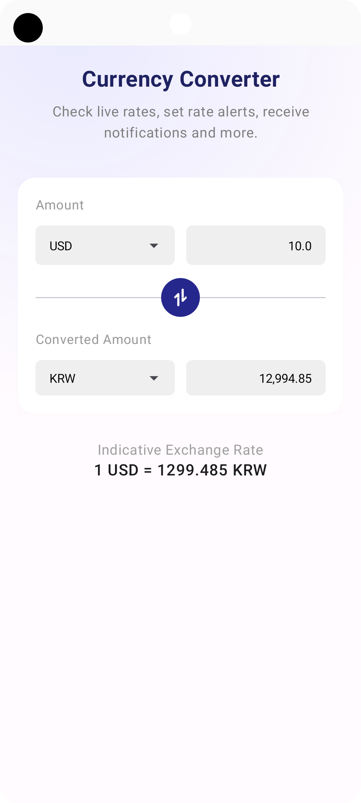

# Currency Convertor

## Pre-setting for build

Set below keys in local.properties file as key-value format

| Key          | Description                               |
|--------------|-------------------------------------------|
| api_key      | api key for fetching latest exchange rate |
| api_base_url | exchange rate api base url                |

## Demo Screenshot

